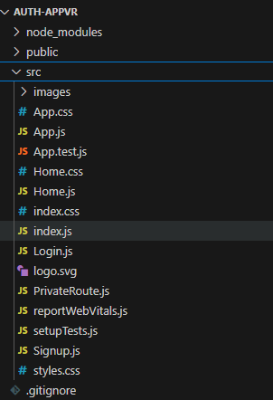
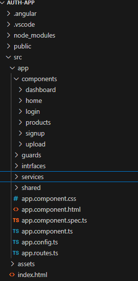
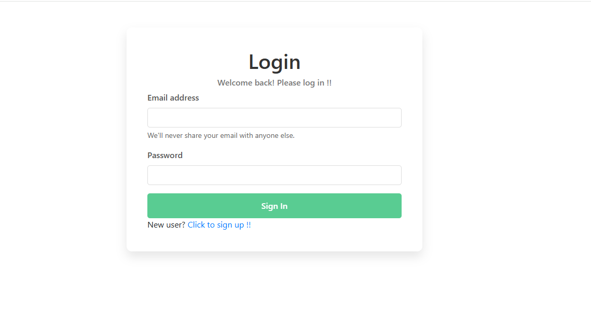
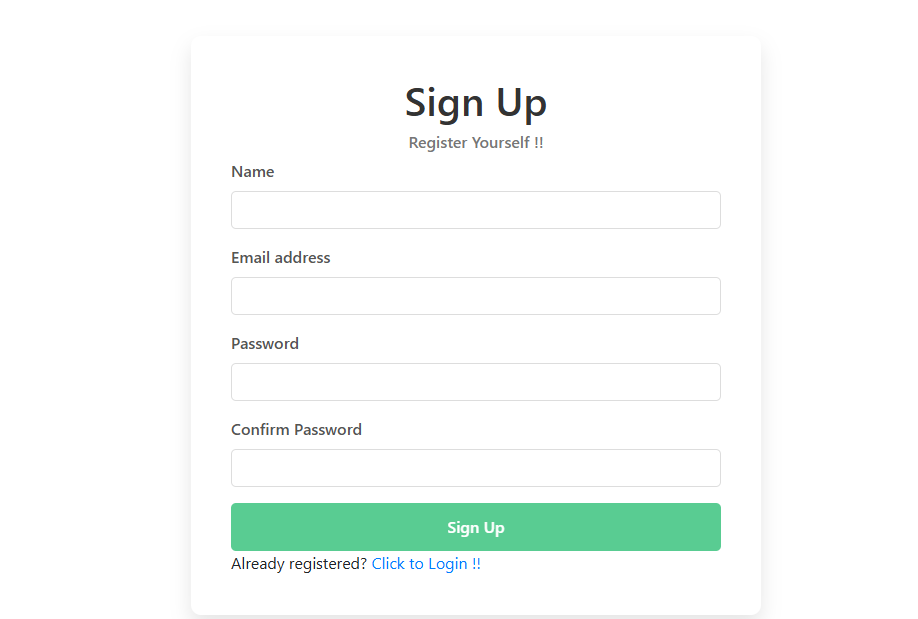
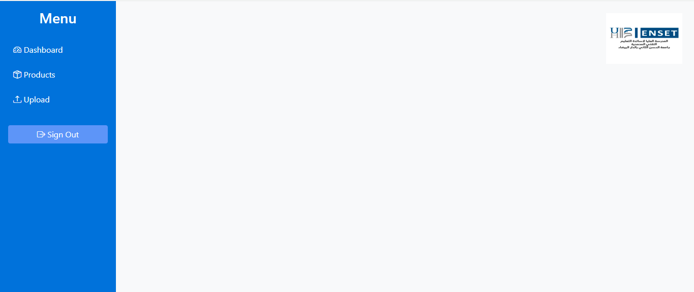

# Authentication System with Angular and React.js

This project is a web application that implements user authentication (Signup, Login, and Logout) using **Angular** and **React.js**. The application uses **JSON Server** to simulate a REST API for storing user data. The goal of this project is to compare the implementation of the same functionalities in both Angular and React.js.
## Features
- **User Registration (Signup)**: Users can create an account by providing their name, email, and password.
- **User Login (Login)**: Users can log in using their email and password.
- **Protected Routes**: Certain pages (e.g., the home page) are only accessible to authenticated users.
- **Logout**: Users can log out, which prevents them from accessing protected pages.
- **Form Validation**: Client-side validation for registration and login forms.
- **Error Handling**: Clear error messages for invalid inputs or failed authentication.
## Technologies Used
### React.js Version
- **React.js**: Frontend library for building user interfaces.
- **React Router**: For routing and navigation.
- **Axios**: For making HTTP requests to the JSON Server.
- **JSON Server**: Simulates a REST API for storing user data.
- **Bootstrap Icons**: For icons in the UI.
### Angular Version
- **Angular**: Frontend framework for building dynamic web applications.
- **Angular Router**: For routing and navigation.
- **HttpClient**: For making HTTP requests to the JSON Server.
- **JSON Server**: Simulates a REST API for storing user data.
- **Bootstrap**: For styling the UI components.
- **Bootstrap Icons**: For icons in the UI.
## Folder Structure
### React.js Version  
 
### Angular Version
 
## Screenshots
### React.js Version && Angular Version 
Below are the screenshots of the Angular version. The React version has a similar interface and functionality.   
-**Login Page:**  
 

-**Signup Page:**  
 

-**Home Page:**  
 
