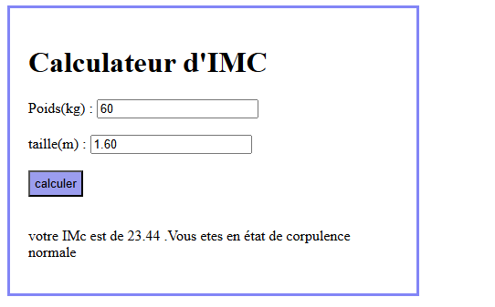

# Exercise 3: BMI Calculator
## Objective
The objective of this exercise is to develop a Body Mass Index (BMI) calculator that evaluates a user's BMI based on their weight (in kilograms) and height (in meters). The calculator categorizes the BMI result according to standard health ranges, providing the user with feedback on their weight status.
## Technologies Used
- HTML.
- CSS.
- JavaScript.
## Explanation of Essential Code
```js
 function imc(){
        var text1=parseFloat(document.getElementById('val1').value);
        var text2=parseFloat(document.getElementById('val2').value);
        var p=document.getElementById('msg');
        const res=(text1 / (text2 * text2)).toFixed(2);
        if(res<18.5){
           p.textContent="votre IMc est de"+res+" .Vous etes en état d'insuffisance pondérale";
        }
        else if(res>=18.5 && res<25){
           p.textContent="votre IMc est de "+res+" .Vous etes en état de corpulence normale";
        }
        else if(res>=25 && res<30){
           p.textContent="votre IMc est de  "+res+" .Vous etes en état de surpoids";
        }
        else if(res>=30 && res<35){
           p.textContent="votre IMc est de  "+res+" .Vous etes en état d'obésité modérée";
        }
        else if(res>=35 && res<40){
           p.textContent="votre IMc est de  "+res+" .Vous etes en état d'obésité sévère";
        }
        else if(res>=40){
           p.textContent="votre IMc est de  "+res+" .Vous etes en état d'obésité morbide ou massive";
        }
    }
```
- The function imc() retrieves the user's inputs, performs the BMI calculation using the formula:
𝐵MI=Weight/Height²  
- The result is rounded to two decimal places using .toFixed(2).
- Conditional statements are used to categorize the result into the following ranges:
   - Underweight: BMI < 18.5
   - Normal weight: 18.5 ≤ BMI < 25
   - Overweight: 25 ≤ BMI < 30
   - Obesity (Moderate): 30 ≤ BMI < 35
   - Obesity (Severe): 35 ≤ BMI < 40
   - Obesity (Morbid): BMI ≥ 40
 - The corresponding message is displayed dynamically in the paragraph element.
## Example Run

